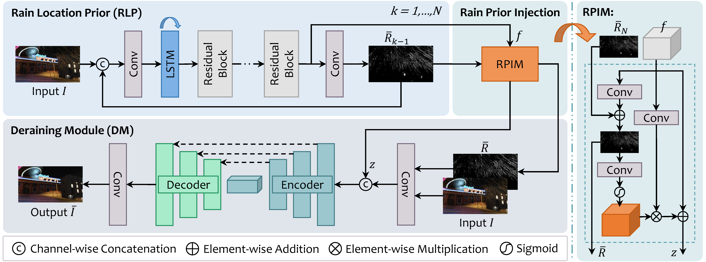
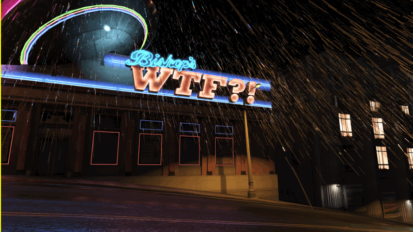

# Learning Rain Location Prior for Nighttime Deraining

> [**Learning Rain Location Prior for Nighttime Deraining**]()  
> Fan Zhang, Shaodi You, Yu Li, Ying Fu  
> ICCV 2023



This repository contains the official implementation and experimental data of the ICCV2023 paper "Learning Rain Location Prior for Nighttime Deraining", by Fan Zhang, Shaodi You, Yu Li, Ying Fu.

[Paper](https://openaccess.thecvf.com/content/ICCV2023/papers/Zhang_Learning_Rain_Location_Prior_for_Nighttime_Deraining_ICCV_2023_paper.pdf) | [Supp](https://openaccess.thecvf.com/content/ICCV2023/supplemental/Zhang_Learning_Rain_Location_ICCV_2023_supplemental.pdf) | [Data](https://www.kaggle.com/datasets/zkawfanx/gtav-nightrain-rerendered-version)


## Update
- [ ] Recollect misaligned data.
- **2023.12.08:** Code release.
- **2023.12.03:** Initial release of experimental data.
- **2023.08.10:** Repo created.


## Dataset



The experimental data used in the paper is now publicly available at [Kaggle](https://www.kaggle.com/datasets/zkawfanx/gtav-nightrain-rerendered-version). It is based on [GTAV-NightRain](https://arxiv.org/pdf/2210.04708.pdf) dataset and increase the difficulty by enlarging the rain density.

In this new version, we collected 5000 rainy images paired with 500 clean images for the training set, and 500/100 for the test set. Each clean image corresponds to 10/5 rainy images. The image resolution is 1920x1080.

#### Note
Please note that this is the very data used in the experiments. 

However, after checking carefully, we find that there exist a few scenes with misalignments due to operation mistakes during collection. We filter out these scenes and there's about 0.5dB improvement in PSNR, which applys to all evaluated methods.

We plan to re-collect and update these misaligned scenes and provide the updated quantitative results later.


## Requirements
- [x] Python 3.6.13
- [x] Pytorch 1.10.2
- [x] Cudatoolkit 11.3

You can refer to [Uformer](https://github.com/ZhendongWang6/Uformer) and [MPRNet](https://github.com/swz30/MPRNet) for detailed dependency list. Necessary list will be updated later.

## Training
- Download the [Dataset](https://www.kaggle.com/datasets/zkawfanx/gtav-nightrain-rerendered-version) on Kaggle or prepare your own training dataset, then modify the `--train_dir` to corresponding directory.
- Train the model by simply run
```
bash train.sh
```
You can
- Select the Deraining Module (DM) by `--arch`, currently supporting `UNet` and `Uformer_T`.
- Enable the Rain Location Prior Module (RLP) by `--use_rlp`.
- Enable the Rain Prior Injection Module (RPIM) using `--use_rpim`, which is only considered when RLP is used.
- Change other parameters in `rlp/options.py`.


## Evaluation
- Prepare your test images or simply test on the downloaded data, by running
```
bash test.sh
```
- Modify `--input_dir` to your `/path/to/test/images` and `--result_dir` for saving results. 
- Modify `--weights` to the model checkpoint you have.
- Modify `--model_name` following the format of `DM`, `DM_RLP` or `DM_RLP_RPIM` according to the model, such as `Uformer_T_RLP_RPIM` when `DM = 'Uformer_T', is_RLP = True, is_RPIM = True`.

### Metrics
To calculate PSNR and SSIM metrics, you can use the Matlab script
```
evaluate_PSNR_SSIM.m
```
or the Python version
```
python evaluate_PSNR_SSIM.py
```
The results produced by `.py` script are slightly different from the `.m` script.


## Checkpoints
|   Model   | DM  | RLP | RPIM | PSNR  | SSIM  | Checkpoint |
| :-------: | :-: | :-: | :--: | :---: | :---: | :---: |
|   UNet    | ✓  |     |      | 36.63 | 0.9693 | [UNet.pth](https://github.com/zkawfanx/RLP/releases/download/v1.0.0/UNet.pth) |
|   UNet    | ✓  | ✓  |      | 37.08 | 0.9715 | [UNet_RLP.pth](https://github.com/zkawfanx/RLP/releases/download/v1.0.0/UNet_RLP.pth) |
|   UNet    | ✓  | ✓  |  ✓  | 37.28 | 0.9716 | [UNet_RLP_RPIM.pth](https://github.com/zkawfanx/RLP/releases/download/v1.0.0/UNet_RLP_RPIM.pth) |
| Uformer_T | ✓  |     |      | 37.45 | 0.9720 | [Uformer_T.pth](https://github.com/zkawfanx/RLP/releases/download/v1.0.0/Uformer_T.pth) |
| Uformer_T | ✓  | ✓  |      | 37.95 | 0.9733 | [Uformer_T_RLP.pth](https://github.com/zkawfanx/RLP/releases/download/v1.0.0/Uformer_T_RLP.pth) |
| Uformer_T | ✓  | ✓  |  ✓  | 38.44 | 0.9749 | [Uformer_T_RLP_RPIM.pth](https://github.com/zkawfanx/RLP/releases/download/v1.0.0/Uformer_T_RLP_RPIM.pth) |


## Citation
If you find this repo useful, please give us a star and consider citing our papers:
```bibtex
@inproceedings{zhang2023learning,
  title={Learning Rain Location Prior for Nighttime Deraining},
  author={Zhang, Fan and You, Shaodi and Li, Yu and Fu, Ying},
  booktitle={Proceedings of the IEEE/CVF International Conference on Computer Vision},
  pages={13148--13157},
  year={2023}
}

@article{zhang2022gtav,
  title={GTAV-NightRain: Photometric Realistic Large-scale Dataset for Night-time Rain Streak Removal},
  author={Zhang, Fan and You, Shaodi and Li, Yu and Fu, Ying},
  journal={arXiv preprint arXiv:2210.04708},
  year={2022}
}
```

## Acknowledgement
The code is re-organized based on [Uformer](https://github.com/ZhendongWang6/Uformer) and [MPRNet](https://github.com/swz30/MPRNe). Thanks for their great works!


## License
MIT license.

CC BY-NC-SA 4.0 for data.